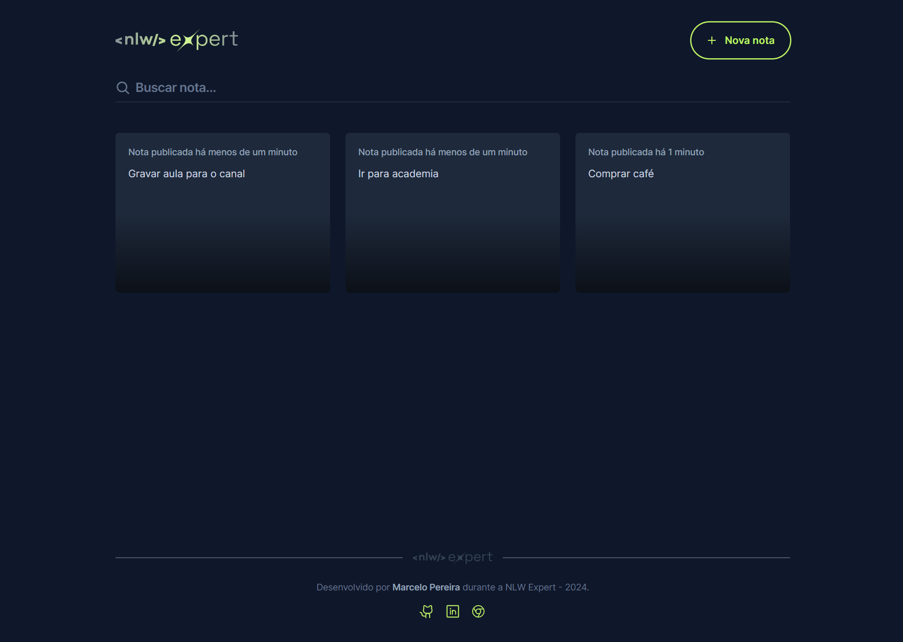

# 📝 Notes - NLW Expert (React)



---

## 📖 Sobre o projeto

Aplicação de notas que permite aos usuários digitarem suas anotações e também transcrever áudio para texto usando o microfone do dispositivo, graças à poderosa Speech Recognition API.

Desenvolvido durante o **NLW Expert** da Rocketseat utilizando React, TypeScript, Tailwind e a SpeechRecognition API.

---

## 🚀 Tecnologias

- ⚛️ ReactJs
- ⚡ Vite
- 🟦 TypeScript
- 💨 TailwindCSS
- 🖼️ Phosphor Icons
- 🔔 Sonner Toast
- 💾 API Web Storage
- 🎤 API Web Speech
- 📅 date-fns

## 🛠️ Instalação e uso rápido

```bash
# Clone o repositório
git clone https://github.com/marcelopoars/nlw-experts-notes.git
cd nlw-experts-notes

# Instale as dependências
npm install

# Rode o projeto em modo desenvolvimento
npm run dev

# Para build de produção
npm run build
```

---

## 🧪 Comandos de qualidade e verificação

```bash
# Checa problemas de lint com ESLint
npm run lint

# Verifica tipos TypeScript sem gerar arquivos
npm run type-check

# Formata todos os arquivos com Prettier
npm run format

# Checa se todos os arquivos estão formatados
npm run format:check

# Executa verificação completa: tipos, lint e formatação
npm run check
```

---

## 🌐 Deploy

Este projeto foi publicado na **Vercel**. Acesse [este link](https://notes.marcelopereira.com.br) para testar a aplicação.

---

## 👤 Sobre o autor

**Marcelo Pereira**<br>
Desenvolvedor Front-End Sênior

- [LinkedIn](https://www.linkedin.com/in/marcelopoars/)
- [Site pessoal](https://www.marcelopereira.com.br/)

---
